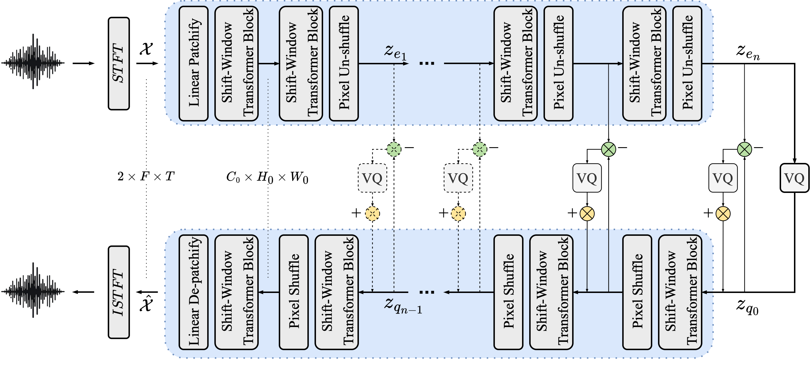
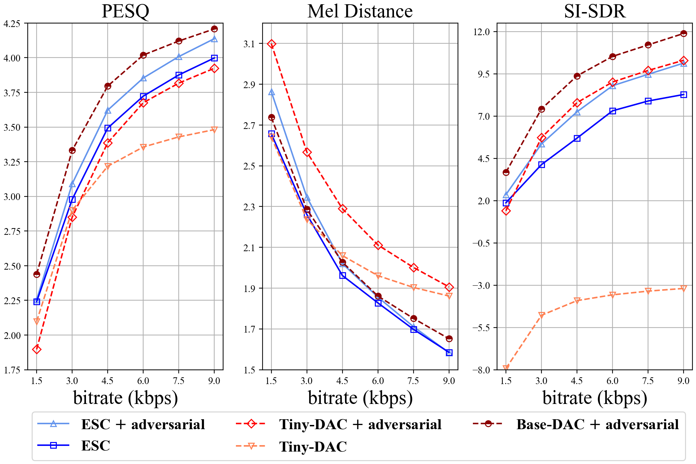

# Efficient Speech Coding with Cross-Scale Residual Vector Quantized Transformers

This is the code repository for the neural speech codec presented in the EMNLP 2024 paper **ESC: Efficient Speech Coding with Cross-Scale Residual Vector Quantized Transformers** [[paper](https://arxiv.org/abs/2404.19441)]
- Our neural speech codec ESC, within only 30MB, efficiently compresses 16kHz speech at bitrates of 1.5, 3, 4.5, 6, 7.5, and 9kbps, while maintaining comparative reconstruction quality to Descript's audio codec. 
- We provide pretrained model checkpoints [[download](#model-checkpoints)] for different ESC variants and DAC models, as well as a demo page [[link](https://western-spatula-93a.notion.site/Efficient-Speech-Codec-0e513f33cf104f799e16bcad015b03ef?pvs=4)] including multilingual speech samples. 


## Usage

### Environment Setup
```bash
conda create -n esc python=3.8
conda activate esc

pip install -r requirements.txt
```

### Compress and de-compress audio
```ruby
python -m scripts.compress  --input /path/to/input.wav --save_path /path/to/output --model_path /path/to/model --num_streams 6 --device cpu 
```
This will create `.pth`(code) and `.wav`(reconstructed audio) files under the specified `save_path`. Our codec supports `num_streams` from 1 to 6, corresponding to bitrates 1.5 ~ 9.0 kbps. For programmatic usage, you can compress audio tensors using `torchaudio` as follows: 

```python
import torchaudio, torch
from esc import ESC
model = ESC(**config)
model.load_state_dict(torch.load("model.pth", map_location="cpu"),)
x, _ = torchaudio.load("input.wav")
# Enc. (@ num_streams*1.5 kbps)
codes, f_shape = model.encode(x, num_streams=6)
# Dec.
recon_x = model.decode(codes, f_shape)
```
For more details, see the `example.ipynb` notebook.

### Training

We provide developmental training and evaluation datasets available on [Hugging Face](https://huggingface.co/datasets/Tracygu/dnscustom/tree/main). For custom training, set the `train_data_path` in `exp.yaml` to the parent directory containing `.wav` audio segments. Run the following to start training:

```ruby
WANDB_API_KEY='your_API_key'
accelerate launch main.py --exp_name esc9kbps --config_path ./configs/9kbps_esc_base.yaml --wandb_project efficient-speech-codec --lr 1.0e-4 --num_epochs 80 --num_pretraining_epochs 15 --num_devices 4 --dropout_rate 0.75 --save_path /path/to/output --seed 53
```

We use `accelerate` library to handle distributed training and `wandb` library for monitoring. To enable adversarial training with the same discriminator in DAC, include the `--adv_training` flag. 

Training a base ESC model on 4 RTX4090 GPUs takes ~12 hours for 250k steps on 3-second speech clips with a batch size of 36. Detailed experiment configurations can be found in the `configs/` folder. For complete experiments presented in the paper, refer to `scripts_all.sh`.  

### Evaluation

```ruby
CUDA_VISIBLE_DEVICES=0
python -m scripts.test --eval_folder_path path/to/data --batch_size 12 --model_path /path/to/model --device cuda
```
This will run codec evaluation across all available bandwidth on the specified test set folder. We provide four metrics for reporting: `PESQ`, `Mel-Distance`, `SI-SDR` and `Bitrate-Utilization-Rate`. Evaluation statistics will be saved under `model_path` by default.  

### Model Checkpoints
You can download the pre-trained model checkpoints below:

| Codec  | Checkpoint                                      | #Param. |
|--------|-------------------------------------------------|----------|
| ESC-Base           | [Download](https://drive.google.com/file/d/1OF1ab3az6nKOY8owSUhUH0ksYHFmR1bc/view?usp=sharing) | 8.39M    |
| ESC-Base(adv)      | [Download](https://drive.google.com/file/d/1_g1dFYhY7qXKWkcq8_Q6I-kv8tQW_SF7/view?usp=sharing) | 8.39M    |
| ESC-Large          | [Download](https://drive.google.com/file/d/180Q4zctqeNnDmRvoMsVQ-3iCB5FriJbN/view?usp=sharing) | 15.58M   |
| DAC-Tiny(adv)      | [Download](https://drive.google.com/file/d/1ED-B_S7ftsb8CqoFGTNkWUIrMKrk-iiu/view?usp=sharing) | 8.17M    |
| DAC-Tiny           | [Download](https://drive.google.com/file/d/1jk8zPYBYmxgsiSzrgoQynF6hnzoiIuX8/view?usp=sharing) | 8.17M    |
| DAC-Base(adv)      | [Download](https://drive.google.com/file/d/1moy0FX-aPlx54MajBRuE-zjYeNlJUjI6/view?usp=sharing) | 74.31M   |

## Results


We provide a comprehensive performance comparison of ESC with Descript's audio codec (DAC) at different scales of model sizes (w/ and w/o adversarial trainings).

## Reference
If you find our work useful or relevant to your research, please kindly cite our paper:
```bibtex
@article{gu2024esc,
        title={ESC: Efficient Speech Coding with Cross-Scale Residual Vector Quantized Transformers},
        author={Gu, Yuzhe and Diao, Enmao},
        journal={arXiv preprint arXiv:2404.19441},
        year={2024}
}
```